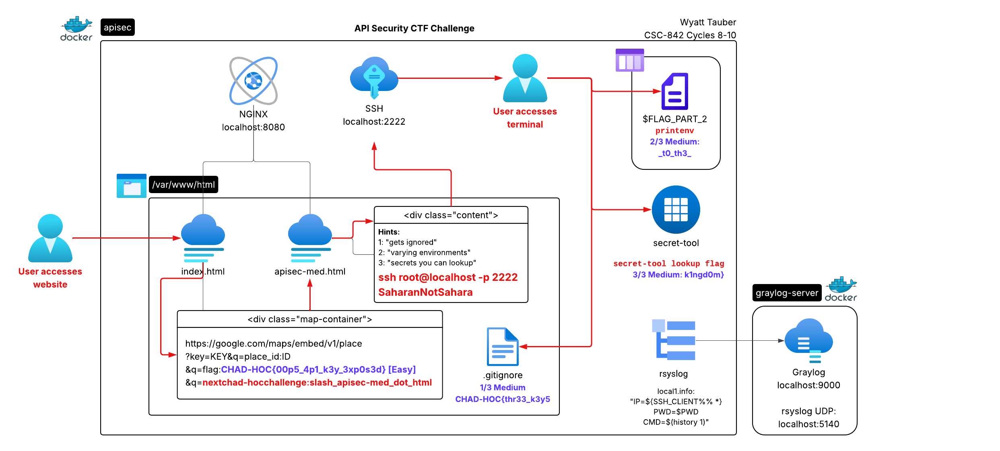

# API Security CTF Challenge
[GitHub](https://github.com/wwt9829/csc842-apisec) | [Docker Hub](https://hub.docker.com/r/wwt92829/csc842-apisec)

DSU CSC-842 Cycle 8 | [Presentation](https://youtu.be/veqoNRxKiAM)

DSU CSC-842 Cycle 10 | [Presentation]()

## Motivation
During the last cycle, I received many questions about how I stored API keys in my [URL Shortener Typo Generator](https://github.com/wwt9829/bit.ly-typos) as well as about API key security in general. In this cycle, I decided to create a demo showing an example of a (harmless) leaked Google Maps API key as well as several methods of more securely storing keys in the form of a CTF challenge. The player will find the insecure key in the Maps frame (easy challenge) along with SSH credentials to progress to the medium challenge. In the medium challenge, the player will find flags in the three common API key storage methods I discussed with my classmates during the previous cycles.

## Infrastructure and Solution

### Cycle 8
* **Dockerfile and Compose file for:**
  * *NGINX web server* with 2 pages containing the easy challenge and the credentials to access the medium challenge
  * *SSH server* to log in to the medium challenge as root and search for the flag
* **Flag components**:
  * *Part 1:* Contained in the .gitignore file in the git repo `/var/www/html`
  * *Part 2:* An environment variable `FLAG_PART_2`
  * *Part 3:* Viewed through `secret-tool` script (due to the lack of actual `secret-tool` in Docker)
    * Fake manpage for `secret-tool` script to convey realism

### Cycle 10
* **More realistic webpage content** for the medium challenge, along with subtle hints, above the credentials
* **Enable HTTPS on NGINX webserver** to improve access to the easy challenge as this is enforced on most browsers
* **Standard user** `chad` instead of root user for accessing the medium challenge, with restrictions:
  * *No grep* to prevent grepping for the flag components without attempting to solve the challenge
  * *Root-owned .bashrc* to ensure the user doesn't accidentally delete the logging components in the file
* **`secret-tool` C application** since standard users cannot access the system keystore by default and the sticky bit doesn't function for Bash scripts
* **Logging to Graylog** via `rsyslog`, reporting the SSH IP address, working directory, and command ran for each interaction
* **SSH banner** with a welcome message and reminders of the CTF rules

## Main Ideas
1. **In a web application, API keys should never be stored in a manner that is accessible client-side.** This application shows an example of a leaked Google Maps API key that is stored in the HTML of a webpage.
2. **There are multiple ways to store API keys on a system, each offering different levels of protection.** This application demonstrates the following storage methods:
    -   **.gitignore'd text file:** The simplest and least secure method, this file isn't pushed to a Git repository but is still accessible on the file system. The access permissions for the API key file can be adjsuted for a bit of extra security, such as restricting access only to certain accounts.
    -   **Environment variables:** While stored in memory instead of on disk, API keys stored in environment variables are still accessible to anyone on the system.
    -   **System secrets manager/keyring:** Perhaps the most secure method, this option stores the API keys in the same manner as systems secrets, resulting in strong security but also more varied implementation due to the reliance on operating system components.
3. **Use Docker secret mounts for secrets management in Docker containers.** Docker containers do not implement dbus, which is required for secrets managment on Linux. Instead, Docker recommends you use [secret mounts](https://docs.docker.com/build/building/secrets/#secret-mounts). (For this container, I implemented a script that takes the place of secret-tool and has only the functionality required to solve the challenge.)

## Future Direction
1. Standard user with reduced shell: I'd like to give the player different SSH credentials for a standard user account with a reduced shell, limiting access to tools like `grep` that would make it more difficult to solve the challenge in unintended ways.
2. Syslog: If this were an actual CTF challenge, I'd also like a way to monitor the commands the users are executing to watch for any circumvention of the rules. I'll probably implement syslog to send Bash history to my syslog server.

## References
No formal references - mostly just the discussions with my classmates from cycles 2, 4, and 6