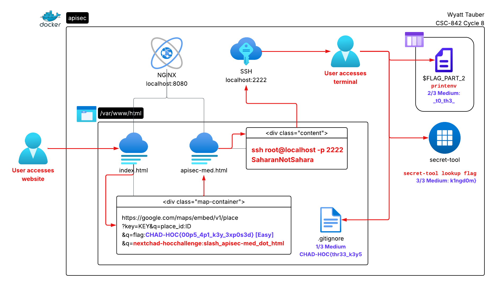

# API Security CTF Challenge
[GitHub](https://github.com/wwt9829/csc842-apisec) | [Docker Hub](https://hub.docker.com/r/wwt92829/csc842-apisec)
DSU CSC-848 Cycle 8 | [Presentation](https://youtu.be/veqoNRxKiAM)
DSU CSC-848 Cycle 10 | [Presentation]()

## Motivation
During the last cycle, I received many questions about how I stored API keys in my [URL Shortener Typo Generator](https://github.com/wwt9829/bit.ly-typos) as well as about API key security in general. In this cycle, I decided to create a demo showing an example of a (harmless) leaked Google Maps API key as well as several methods of more securely storing keys in the form of a CTF challenge. The player will find the insecure key in the Maps frame (easy challenge) along with SSH credentials to progress to the medium challenge. In the medium challenge, the player will find flags in the three common API key storage methods I discussed with my classmates during the previous cycles.

## Infrastructure and Solution


### Sample compose.yml
```
services:
  apisec:
    build:
      dockerfile: Dockerfile
    image: wwt92829/csc842-cycle8
    ports:
      - "8080:80"   # Web server
      - "2222:22"   # SSH
    container_name: csc842-cycle8
    restart: always
```

## Main Ideas
1. **In a web application, API keys should never be stored in a manner that is accessible client-side.** This application shows an example of a leaked Google Maps API key that is stored in the HTML of a webpage.
2. **There are multiple ways to store API keys on a system, each offering different levels of protection.** This application demonstrates the following storage methods:
    -   **.gitignore'd text file:** The simplest and least secure method, this file isn't pushed to a Git repository but is still accessible on the file system. The access permissions for the API key file can be adjsuted for a bit of extra security, such as restricting access only to certain accounts.
    -   **Environment variables:** While stored in memory instead of on disk, API keys stored in environment variables are still accessible to anyone on the system.
    -   **System secrets manager/keyring:** Perhaps the most secure method, this option stores the API keys in the same manner as systems secrets, resulting in strong security but also more varied implementation due to the reliance on operating system components.
3. **Use Docker secret mounts for secrets management in Docker containers.** Docker containers do not implement dbus, which is required for secrets managment on Linux. Instead, Docker recommends you use [secret mounts](https://docs.docker.com/build/building/secrets/#secret-mounts). (For this container, I implemented a script that takes the place of secret-tool and has only the functionality required to solve the challenge.)

## Future Direction
1. Standard user with reduced shell: I'd like to give the player different SSH credentials for a standard user account with a reduced shell, limiting access to tools like `grep` that would make it more difficult to solve the challenge in unintended ways.
2. Syslog: If this were an actual CTF challenge, I'd also like a way to monitor the commands the users are executing to watch for any circumvention of the rules. I'll probably implement syslog to send Bash history to my syslog server.

## References
No formal references - mostly just the discussions with my classmates from cycles 2, 4, and 6